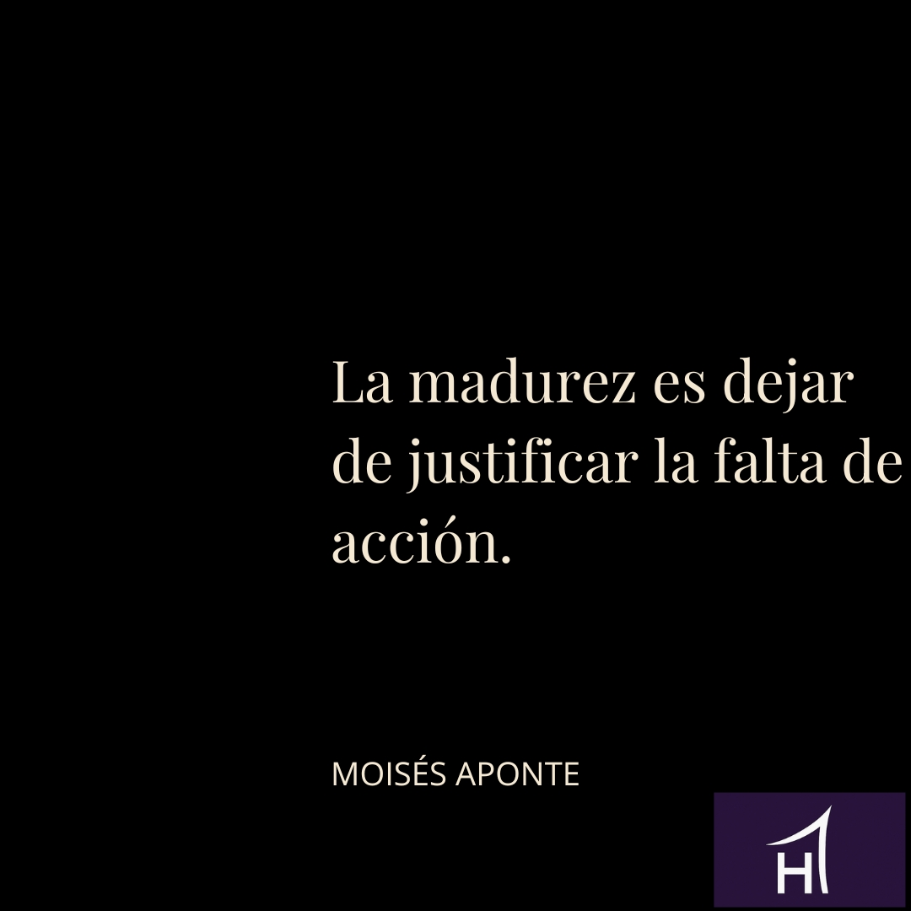

## De las excusas a las decisiones

Como emprendedor convives con presión, incertidumbre y más ideas de las que puedes ejecutar.  
Clientes, números, equipo y vida personal compiten a diario por tu atención, y no es raro entrar en modo supervivencia sintiendo que el día nunca alcanza.

En ese contexto, la palabra *madurez* puede sonar lejana.  
Sin embargo, suele ser justo lo que marca la diferencia entre un proyecto que desgasta y un negocio que sostiene tu vida.

La madurez del emprendedor no tiene que ver con la edad ni con los años de experiencia.  
Tiene que ver con el momento exacto en el que dejas de justificar tu falta de acción y empiezas a tratar tus excusas como problemas que requieren una decisión.

---

## Qué significa madurar como emprendedor

Madurar no es volverse rígido ni perder pasión.  
Es cambiar la postura interna desde la que respondes a lo que ocurre.

Es pasar de *“explicar por qué no puedo”* a *“decidir qué voy a hacer con lo que hay”*.

Cuando justificas la falta de acción, tu mente suele caer en dos posiciones conocidas:

- **Víctima:** todo es culpa del contexto, la economía, el algoritmo, los clientes o la competencia.  
- **Avestruz:** confiar en que “algún día” las cosas se ordenarán solas sin tomar decisiones incómodas.

Desde ahí, las decisiones se vuelven reactivas, defensivas o directamente inexistentes.  
La atención se va a lo que no controlas y la energía se pierde en quejas, comparaciones y ruido mental.

Un emprendedor maduro no niega las dificultades.  
Simplemente deja de usarlas como excusa para no decidir.

---

## Tres excusas muy reales (y muy peligrosas)

Hay tres justificaciones especialmente comunes entre emprendedores.  
Son reales. Y precisamente por eso, tan fáciles de creer.

### 1. “Estoy cansado”

El cansancio es un síntoma, no una identidad.  
Muchas veces no viene de trabajar demasiado, sino de trabajar desordenado: demasiados frentes abiertos, decisiones postergadas y tareas que nunca se cierran.

Cuando el cansancio se vuelve crónico aparecen señales claras: falta de enfoque, dificultad para priorizar, irritabilidad y procrastinación.  
La justificación se vuelve perfecta: *“no avanzo porque estoy agotado”*.

En muchos casos, la madurez empieza cuando decides qué dejar de hacer.  
Cerrar proyectos, simplificar servicios o soltar clientes que consumen más de lo que aportan devuelve energía y claridad.

### 2. “El sistema no ayuda”

Impuestos, burocracia, cambios legales e incertidumbre económica existen.  
El problema aparece cuando el discurso se convierte en *“aquí no se puede”* o *“con este sistema es imposible”*.

Cuando toda tu atención se queda ahí, tu sensación de poder personal cae y tus decisiones se vuelven defensivas.  
Madurar no es negar el contexto, sino dejar de usarlo como explicación permanente y centrarte en el pequeño margen de maniobra que sí depende de ti.

### 3. “No tengo tiempo”

“No tengo tiempo” casi siempre significa *“no está en mi lista real de prioridades”*.  
El tiempo no se encuentra: se decide, se protege y se organiza.

Si tú no decides qué merece un lugar fijo en tu agenda, otros lo decidirán por ti.  
Un emprendedor maduro trata su agenda como un reflejo de sus decisiones, no como un resumen de cómo sobrevivió a la semana.

---

## El giro clave: de justificar a comprometerse

Justificar cambia el enfoque.  
Y donde va el enfoque, va la energía.

Cuando te centras en el cansancio, el sistema o la falta de tiempo, el mensaje interno es claro: *“no hay mucho que pueda hacer”*.  
Desde ahí, la acción se reduce a lo mínimo.

El giro ocurre cuando cambias la interpretación:

- De *“estoy cansado”* a *“mi forma de trabajar me está desgastando y necesito rediseñarla”*.  
- De *“el sistema no ayuda”* a *“¿dónde está mi margen de acción aquí?”*.  
- De *“no tengo tiempo”* a *“no he decidido que esto sea prioridad”*.

Ese cambio no es motivación.  
Es el punto de partida para decisiones concretas.

Madurar, al final, es estar dispuesto a mirar tus excusas sin maquillaje y asumir qué decisión estás evitando.

---

## Decisiones maduras en la práctica

Algunos ejemplos claros de cómo se ve la madurez en el día a día:

1. **Ordenar el negocio para cuidar tu energía**  
   Simplificar ofertas, eliminar líneas poco rentables y dejar de sostener estructuras que ya no tienen sentido.

2. **Actuar dentro de tu control real**  
   Mejorar procesos, comunicación, ventas o alianzas en lugar de quedarte atrapado en conversaciones estériles sobre lo mal que está todo.

3. **Proteger tiempo para pensar y decidir**  
   Bloquear espacios semanales para trabajar *en* el negocio, no solo *dentro* de él, y convertir ideas en acciones con fecha.

---

## Lo que aprendemos

La madurez del emprendedor no se siente cómoda.  
Se nota cuando dejas de explicarte y empiezas a decidir.

Si has llegado hasta aquí y este texto te incomodó un poco, no es casualidad.  
Este punto —dejar de justificar y empezar a comprometerte— es exactamente donde muchos proyectos se quedan estancados durante años.

Si estás ahí, no necesitas más contenido.  
Necesitas claridad, estructura y decisiones que se cumplan.

